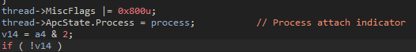
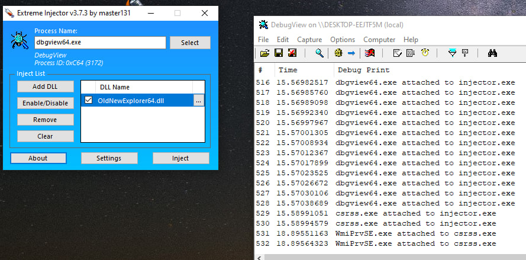

# DetectAttachProcess
Proof of Concept

### Reversing
В глубине KeAttachProcess вызывает KiAttachProcess передавая туда текущий поток и процесс. Внутри этой функции для потока остаётся след за процессом:

Используя это мы можем пройтись по всем процессам и их потокам и найти данный след

### Bypass
Вы можете обойти это легким способом - после атача вернуть старые MiscFlags и Process в ApcState

### Pictures

### References
* [FindWDK](https://github.com/SergiusTheBest/FindWDK)
